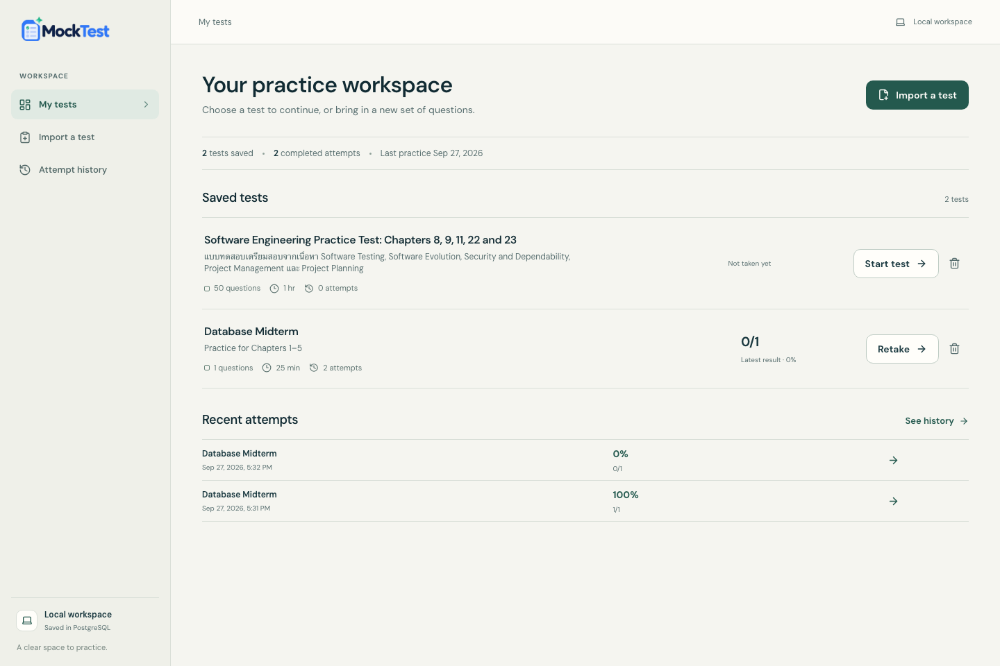

# MockTest

MockTest turns multiple-choice questions from your study tool into a focused, timed exam. Import a test, take it in your browser, then review your score, answers, and explanations. Tests and attempts are saved in this browser with `localStorage`.

MockTest does not generate questions or send them to an AI service. Create questions with the study tool you choose, then import them as JSON.

## Features

- Paste or upload a test and get feedback when its JSON needs fixing.
- Take a timed exam with answers saved as you go.
- Review scores, correct answers, and explanations after submitting.
- Keep attempt history and retake saved tests.
- Copy or download incorrect and unanswered questions as JSON for further study.

## Web app



*Dashboard preview with example test and attempt data.*

After starting the app, open one of these pages:

- [Dashboard](http://localhost:5173/dashboard)
- [Import a test](http://localhost:5173/create)
- [Attempt history](http://localhost:5173/history)

## Run locally

You need [Bun](https://bun.sh/).

Install dependencies:

```bash
bun install
```

Start the web app:

```bash
bun run dev
```

Open [http://localhost:5173](http://localhost:5173). Your tests and attempts stay in this browser profile; they do not sync across browsers or devices. Clearing this site’s browser storage deletes them. The app also needs browser storage enabled to save progress.

Tests from the previous PostgreSQL setup are not transferred automatically. Reimport their source JSON to add them to browser storage.

This is a local practice tool without sign-in or user separation. Browser storage can be inspected or changed by the person using the browser, so it is not suitable for proctored or high-stakes exams.

## Import format

MockTest accepts JSON version `1.0` with a title, an optional description, a duration from 1 to 180 minutes, and 1 to 100 questions. Each question needs a unique ID, the type `multiple_choice`, a question, exactly four non-empty options, and the zero-based index of the correct option (`0` to `3`). An explanation is optional. Imports are limited to 1 MB.

Example:

```json
{
  "version": "1.0",
  "title": "Database Midterm",
  "description": "Practice for chapters 1–5",
  "duration_minutes": 30,
  "questions": [
    {
      "id": "q1",
      "type": "multiple_choice",
      "question": "What does a primary key do?",
      "options": [
        "Uniquely identifies a row",
        "Names a table",
        "Connects to a server",
        "Sorts every query"
      ],
      "answer": 0,
      "explanation": "A primary key gives each row a unique identifier."
    }
  ]
}
```

See [`docs/sample-mocktest.json`](docs/sample-mocktest.json) for a complete sample, or copy the prompt from [`docs/Mock Test JSON Prompt.md`](docs/Mock%20Test%20JSON%20Prompt.md) into your study tool. The schema is defined in [`packages/shared/src/schema.ts`](packages/shared/src/schema.ts).

## Missed-question export

After submitting, use **Copy JSON** or **Download JSON** to export incorrect and unanswered questions. The `mocktest.missed-questions.v1` format includes your answer, the correct answer, and any explanation. Use **Preview JSON** on the result page to inspect the export before copying or downloading it. Its schema is defined in [`packages/shared/src/missed-questions.ts`](packages/shared/src/missed-questions.ts).

## Commands

| Command | What it does |
| --- | --- |
| `bun run dev` | Start the web app for local development. |
| `bun run typecheck` | Type-check the shared package and web app. |
| `bun run test` | Run shared-schema tests. |
| `bun run test:e2e` | Run Playwright end-to-end checks. |

## License

This project is licensed under the MIT License. See [LICENSE](LICENSE).

## Project structure

```text
apps/web/                 React, Vite, TypeScript, and browser storage
apps/api/                 Retained API package; not used by the web app
packages/shared/          Test and missed-question JSON schemas
docs/sample-mocktest.json Example test data
```
